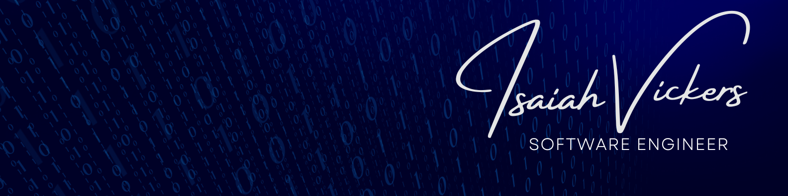
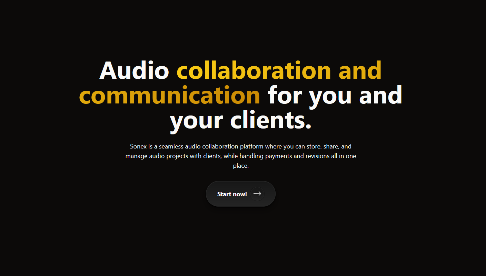
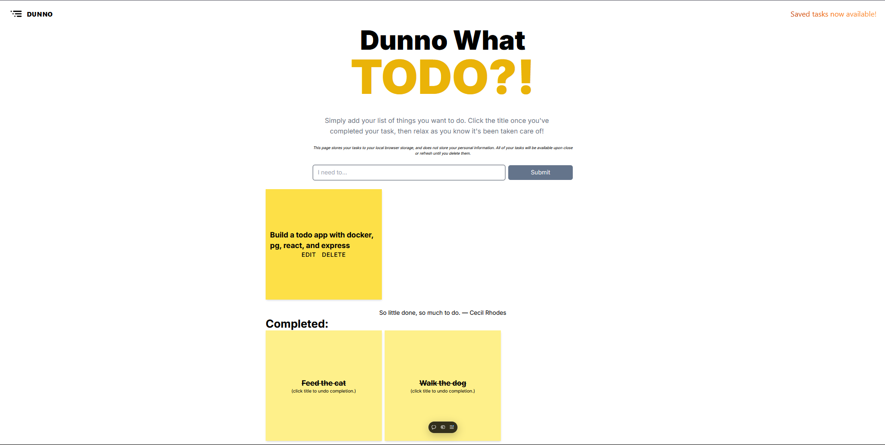

<link rel="stylesheet" href="https://cdn.jsdelivr.net/gh/devicons/devicon@latest/devicon.min.css">

  

<h3 align="center">Hi 👋! My name is Isaiah, and I'm a Full Stack Web Developer/Backend Systems Engineer</h3>

<h2>About Me</h2>

I am ...

  👨🏾‍💻 a full stack web developer with interests in Cloud Engineerig, DevOps, and Systems Architecture
   
  🎓 a current student at App Academy | Graduating <strong><em>December 2024</em></strong>
   
  🧠 an avid lifelong learner of new technologies, while grounding myself in fundamental programming concepts
   
  🎧 a Professional Audio Engineer who is looking to build innovative products with a focus on audio quality and user experience

## ⭐ Works I'm Proud Of ⭐

<table>
  <tbody>
    <tr>
      <td valign="top">
        

          

            <h3>Sonex</h3>
            
            

              A social media platform for audio engineers to connect, share, and collaborate on audio projects.
            

          

          

            <h4>Technologies Used</h4>
            
React, Node.js, Express, MongoDB, AWS, Stripe

          

          

            <a href="https://github.com/izzymadethat/sonex" rel="nofollow">View Repo</a>
            |
            <a href="#">Releases Jan 2025</a>
          

        

      </td>
      <td valign="top">
        

          

            <h3>Dunno</h3>
            
            

              A todo app built in the style of the classic sticky notes.
            

          

          

            <h4>Technologies Used</h4>
            
Next.js, TailwindCSS, WebStorage

          

          

            <a href="https://github.com/izzymadethat/dunno-todoapp" rel="nofollow">View Repo</a>
            |
            <a href="https://dunno-todoapp.vercel.app/" rel="nofollow" target="_blank">View Live</a>
          

        

      </td>
    </tr>
  </tbody>
</table>

## 🖥️ Technologies I've Worked With
<h3>Frontend Languages & Frameworks</h3>

  <i class="devicon-html5-plain-wordmark colored"></i>
  <i class="devicon-css3-plain-wordmark colored"></i>
  <i class="devicon-javascript-plain colored"></i>
  <i class="devicon-typescript-plain colored"></i>
  <i class="devicon-react-original colored"></i>
  <i class="devicon-nextjs-plain colored"></i>
  <i class="devicon-redux-original colored"></i>
  <i class="devicon-tailwindcss-plain colored"></i>
  <i class="devicon-sass-original colored"></i>

<h3>Backend Languages & Frameworks</h3>

  <i class="devicon-python-plain colored"></i>
  <i class="devicon-flask-original colored" style="color: #c1c1c1;"></i>
  <i class="devicon-nodejs-plain colored"></i>
  <i class="devicon-rails-plain colored"></i>
  <i class="devicon-express-original colored"></i>
  <i class="devicon-csharp-plain colored"></i>
  <i class="devicon-amazonwebservices-plain colored"></i>
  <i class="devicon-firebase-plain colored"></i>
  <i class="devicon-supabase-plain colored"></i>

<h3>Databases</h3>

  <i class="devicon-postgresql-plain colored"></i>
  <i class="devicon-mysql-plain colored"></i>
  <i class="devicon-sqlite-plain colored"></i>
  <i class="devicon-mongodb-plain colored"></i>
  <i class="devicon-sqlalchemy-plain-wordmark"></i>
  <i class="devicon-sequelize-plain colored"></i>
  <i class="devicon-prisma-original colored"></i>
  <i class="devicon-mongoose-original-wordmark colored"></i>

<h3>Additional Tools & Technologies</h3>

  <i class="devicon-linux-plain colored"></i>
  <i class="devicon-docker-plain colored"></i>
  <i class="devicon-kubernetes-plain colored"></i>
  <i class="devicon-git-plain colored"></i>
  <i class="devicon-github-original colored"></i>

<h2>📈 GitHub Stats 📊</h2>

###

  </img>
   </img>
  

 </img>

 

###

<!-- 

  
  
  

###

 

### -->

<!---
izzymadethat/izzymadethat is a ✨ special ✨ repository because its `README.md` (this file) appears on your GitHub profile.
You can click the Preview link to take a look at your changes.
--->
